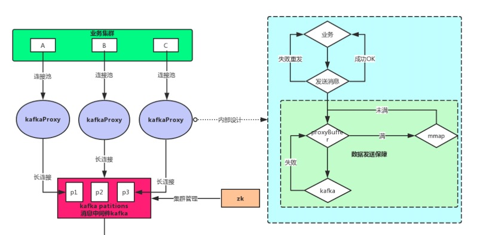

### 架构设计
------
为了使业务方专注于业务代码的实现而不再过分关注消息队列相关问题，同时考虑到pan的扩展性、稳定性、可用性等问题，我们对pan的整体设计如下图：

图中紫色的kafkaProxy就是pan，右侧是pan内部的架构设计

* 业务方通过tcp或者unixSockect的方式将消息传给pan
* pan负责将消息投递到制定的消息队列
* pan内部保证消息不会丢失、不重复投递

pan的内部有三个概念，server、pchan、proxy，三者的关系如下图所示：

* server通过tcp或者unixSocket方式接收业务方数据，然后将数据传给pchan
* pchan内部有两个缓冲队列，分别是input和output，input用来接收server接收的数据，output用来将数据传递给下游proxy，同时内部维持一个mmap，若output队列已满，说明下游发消息阻塞，那么pchan会先将数据落盘
* proxy是一个接口，用来管理下游不同类型的消息队列，proxy负责将消息转发到不同的消息队列

接下来我们分别详细介绍server、pchan、proxy的实现