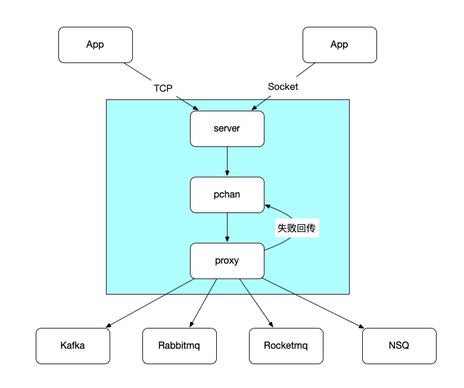
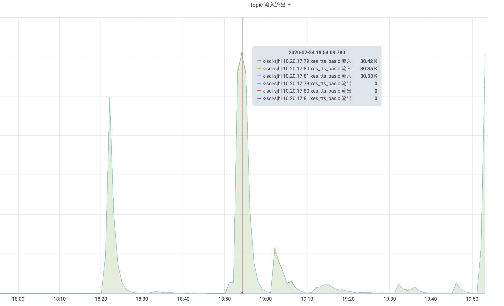

>部门：互联网产品研发部-学习研发部
>
>项目地址：https://git.100tal.com/wangxiao_go_center/pan
>
>项目简介：[MQ生产管家]高性能、高稳定的MQ代理服务

### 一、项目背景

消息队列，一般我们会简称它为MQ(Message Queue)，目前在越来越多的业务场景中被使用，例如日志收集、异步处理、服务解耦等。在业务架构中引入消息队列，我们必然要对消息队列的高可用有一定的要求，那么除了业务逻辑的实现以外，业务方必然还要关注消息队列的可靠性，包括消息丢失、消息重复、消息失败重试等机制，其实这些逻辑一般都与业务逻辑关系不大，但是却需要花费很大的精力在上面。pan致力于解决业务方在消息生产时所遇到的一系列问题，让业务方专注于业务代码的实现，有关消息队列的一切问题都交给pan。	

### 二、项目目标

#### 1、高可靠

首先，pan必须保证消息不会丢失、不会重复，这是业务方最关注的一点，也是pan的基石。pan内部使用内存映射机制在磁盘上开辟了一块4G大小的空间用来存储消息，当消息队列发生问题，pan无法将数据发送到消息队列时，pan会将消息落盘进行持久化，保证消息不会丢失。

#### 2、高性能

其次，pan必须具有高性能的品质，因此我们使用纯Go语言来实现pan，在实际使用过程中pan的表现也十分符合我们的预期。我们在pan内部预留了一定空间的buffer，在正常情况下，数据不会落盘，只会在buffer中进行流转，只有在消息队列异常、发送消息阻塞的情况下，消息才会落盘。下面给出我们对pan的性能测试数据：

| 测试名称        | kafkautil发送性能   |  pan转发性能  |
| --------   | :-----:  | :----:  |
| BenchmarkKafkaFor10Byte     | 50000ns/op |   1.9w/s     |
| BenchmarkKafkaFor100Byte        |   50000ns/op   |   1.83w/s   |
| BenchmarkKafkaFor1000Byte        |    50000ns/op    |  1.72w/s  |
| BenchmarkKafkaFor5000Byte        |    50000ns/op    |  1.53w/s  |


#### 3、易扩展

pan可以兼容多种MQ，业务方只需要pan就可以快速接入多种不同的MQ队列，从而省去对接成本，如下图所示



图中阴影部分就是pan。

### 三、项目价值

>支持业务方快速的接入各种不同的消息队列，节省对接成本；
>
>业务方可以专注业务逻辑的实现，无需考虑消息重复、消息丢失，甚至消息队列异常重连等场景。

### 四、开源价值

为了吸引更多的伙伴加入我们，我们将pan开源，地址请见https://git.100tal.com/wangxiao_go_center/pan
；我们希望越来越多的伙伴更够贡献idea给我们，提升pan的性能，使pan变得更加可靠，更加贴合业务需求，欢迎大家的加入。

### 五、项目案例

#### 1、大班整合

大班整合项目消息队列使用Kafka，整体用Go语言开发，所以我们提供了Go版本的client，方便大班整合业务能够快速在代码中对接pan，client使用方式（仅是示例）具体如下：

```go
package main
 
import (
    "fmt"
    "time"
 
    "git.100tal.com/wangxiao_go_lib/xesTools/kafkautil"

    "github.com/spf13/cast"
)
 
func main() {
    t := time.Tick(5 * time.Second)
    count := 0
    for {
        select {
        case <-t:
            count++
            err := kafkautil.Send2Proxy("test", []byte("kafka "+cast.ToString(count)))
            if err != nil {
                fmt.Println(err)
            }
            continue
        }
    }
}

```

git地址请见：https://git.100tal.com/wangxiao_go_lib/xesTools/tree/master/kafkautil

我们统计了下，大班整合项目中具体使用到pan的地方有大约30处，topic总计有30多个，涉及到教学、互动、回放、直播等多个核心环节。

#### 2、OA重构

在OA重构项目中，电话模块是pan的重度使用用户，topic总计有6个，包括双呼拨打记录，回单记录，tts拨打记录，回单记录，短信发送记录，录音记录等多个核心功能，发送消息峰值最高纪录达到每分钟30k，pan的性能是足以满足业务需求的。



另外，除了Go版本的client，我们同时提供了PHP版本的client供大家使用，git地址请见：https://git.100tal.com/wangxiao_jiaoguan_php/kafkaproxy

### 六、未来展望

我们的目标是将pan打造成一个高性能、高可靠、易扩展的消息队列中间件代理，我们希望

- 可以支持更多的消息队列类型；
- 支持服务注册和服务发现，有更强的容灾能力，程序更加健壮；

希望有越来越多的伙伴使用pan，加入我们，让pan变得更好。