### 性能测试
-----
#### 测试目标
-----
本次测试的目标是测试pan的性能，主要针对kafka

#### 测试方案
-----
因为pan的主要使用场景是作为业务机器的本地代理，所以我们主要测试pan作为本地代理时，对消息的转发性能。我们通过go的Benchmark来完成压测，分别测试消息长度为10byte、100byte、1000byte、5000byte四种情况下，pan的转发性能

#### 测试机器
-----
* OS：CentOS Linux release 7.4.1708 (Core)
* CPU: 4
* Memory: 8G

#### 测试代码
-----
详细的测试代码请见[这里](https://git.100tal.com/wangxiao_go_center/pan/blob/master/test/kafka_test.go)

#### 测试过程
-----
##### 1、BenchmarkKafkaFor10Byte
-----
我们执行以下命令来观察压测输出
```shell
go test -test.bench="BenchmarkKafkaFor10Byte" -count=100
```
我们得到Benchmark测试结果为，部分截图如下,这是我们使用kafkautil发送消息的压测数据：
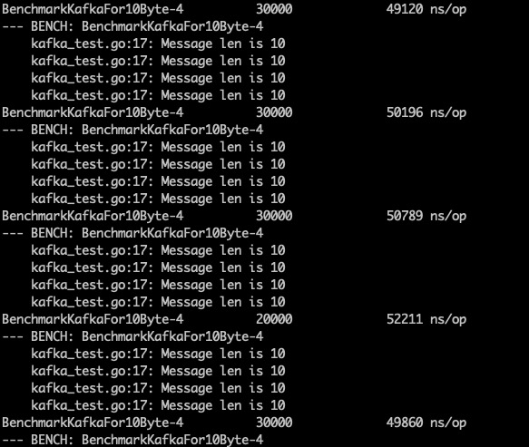

我们可以看到数据基本在50000ns/op，然后我们再来看pan内部接收到消息后转发到kafka的性能，我们每分钟统计了pan内部成功转发到kafka的消息计数，我们来看日志：
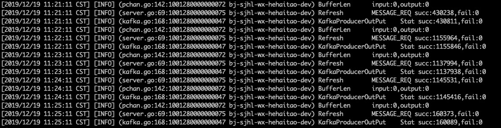

因为是每分钟统计一次，所以第一分钟和最后一分钟的数据我们舍弃(因为可能前几十秒或者后几十秒压测已经结束)，我们只取中间数据，平均每分钟发送113w条数据，平均每秒大概发送1.9w条数据，此时4核CPU基本已经跑到40%
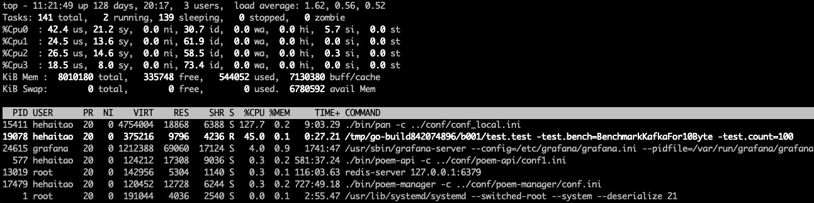

##### 2、BenchmarkKafkaFor100Byte
-----
我们执行以下命令来观察压测输出
```shell
go test -test.bench="BenchmarkKafkaFor100Byte" -count=100
```
我们得到Benchmark测试结果为，部分截图如下,这是我们使用kafkautil发送消息的压测数据：
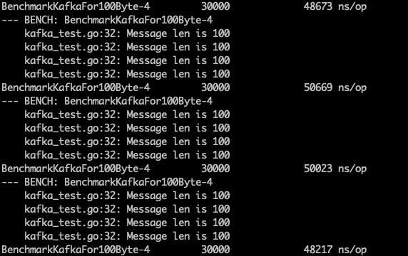

我们可以看到数据基本在50000ns/op，然后我们再来看pan内部接收到消息后转发到kafka的性能，我们每分钟统计了pan内部成功转发到kafka的消息计数，我们来看日志：
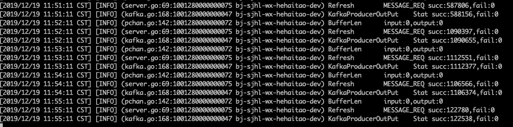

因为是每分钟统计一次，所以第一分钟和最后一分钟的数据我们舍弃(因为可能前几十秒或者后几十秒压测已经结束)，我们只取中间数据，平均每分钟发送110w条数据，平均每秒大概发送1.83w条数据，此时4核CPU基本已经跑到40%，与10byte无较大差别。
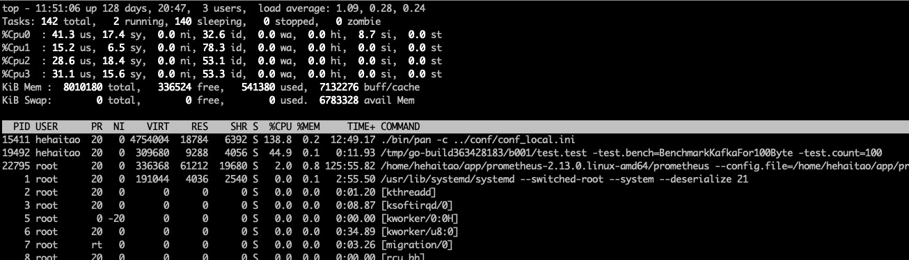

##### 3、BenchmarkKafkaFor1000Byte
-----
我们执行以下命令来观察压测输出
```shell
go test -test.bench="BenchmarkKafkaFor1000Byte" -count=100
```
我们得到Benchmark测试结果为，部分截图如下,这是我们使用kafkautil发送消息的压测数据：
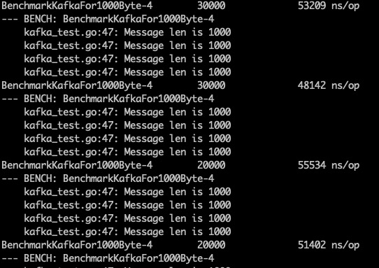

我们可以看到数据基本在50000ns/op，然后我们再来看pan内部接收到消息后转发到kafka的性能，我们每分钟统计了pan内部成功转发到kafka的消息计数，我们来看日志：
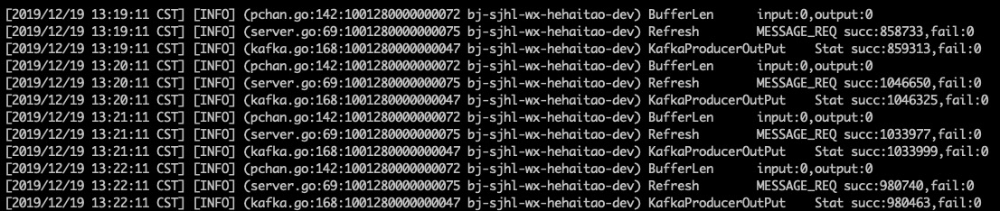

因为是每分钟统计一次，所以第一分钟和最后一分钟的数据我们舍弃(因为可能前几十秒或者后几十秒压测已经结束)，我们只取中间数据，平均每分钟发送103w条数据，平均每秒大概发送1.716w条数据，此时4核CPU基本已经跑到40%
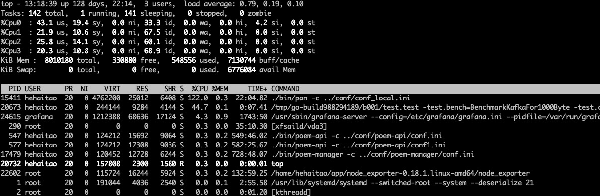

##### 4、BenchmarkKafkaFor5000Byte
-----
我们执行以下命令来观察压测输出
```shell
go test -test.bench="BenchmarkKafkaFor5000Byte" -count=100
```
我们得到Benchmark测试结果为，部分截图如下,这是我们使用kafkautil发送消息的压测数据：
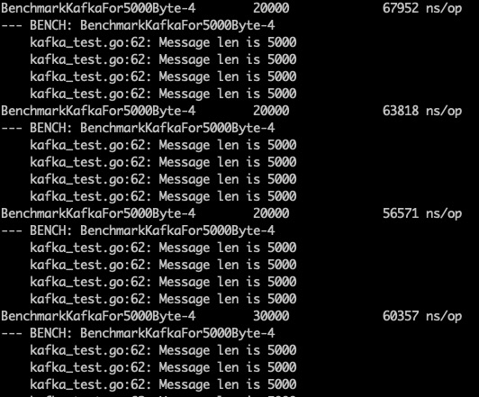

我们可以看到数据基本在50000ns/op，然后我们再来看pan内部接收到消息后转发到kafka的性能，我们每分钟统计了pan内部成功转发到kafka的消息计数，我们来看日志：
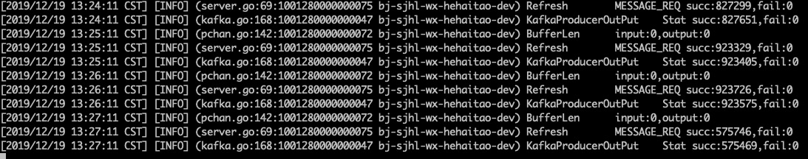

因为是每分钟统计一次，所以第一分钟和最后一分钟的数据我们舍弃(因为可能前几十秒或者后几十秒压测已经结束)，我们只取中间数据，平均每分钟发送92w条数据，平均每秒大概发送1.53w条数据，此时4核CPU基本已经跑到40%
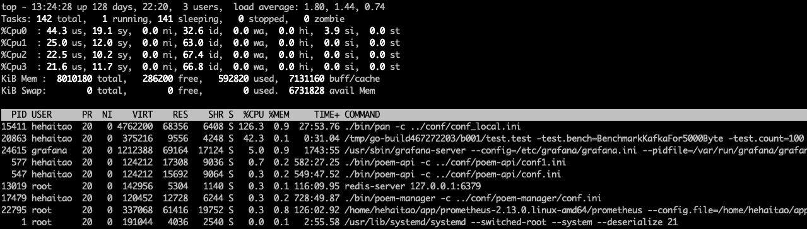

#### 测试结果
-----
对比各种不同消息长度的测试结果如下表：

| 测试名称        | kafkautil发送性能   |  pan转发性能  |
| --------   | :-----:  | :----:  |
| BenchmarkKafkaFor10Byte     | 50000ns/op |   1.9w/s     |
| BenchmarkKafkaFor100Byte        |   50000ns/op   |   1.83w/s   |
| BenchmarkKafkaFor1000Byte        |    50000ns/op    |  1.72w/s  |
| BenchmarkKafkaFor5000Byte        |    50000ns/op    |  1.53w/s  |

#### 测试结论
-----
由上表可以得出结论：不同消息长度对kafkautil的发送性能基本无影响，因为是本地转发的原因；消息长度越大，pan的转发性能会有所下降，但是性能依然很强劲。