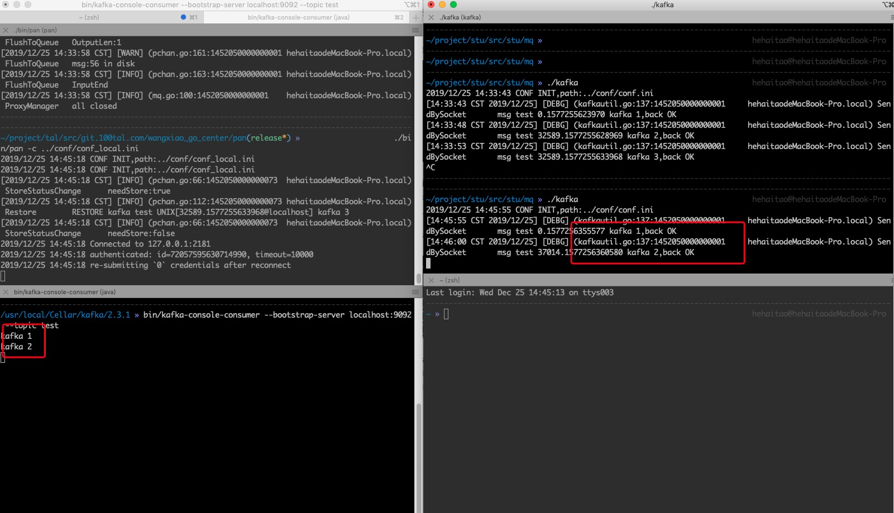

### 稳定性建设
-----
本节主要介绍pan的周边稳定性建设，包括进程的重启、进程的监控、消息队列不可达等多种异常情况下，pan的稳定性。pan的终极目的就是在多种异常的情况下，pan不会丢失数据。

目前pan已经在我们的OA整合项目生产环境中使用。
#### 1、进程挂掉

我们手动将pan进程kill掉，因为目前pan是由supervisor管理，supervisor会自动拉起进程，耗时不超过5s，如下图所示：

#### 2、监控
-----
##### go内存监控
我们对pan的进程开启了内存状态的监控，如下图所示

具体如何开启，我们在进程管理的文档中有详细的介绍，请看[这里](http://go.xesv5.com/apm/#/README)。

##### 日志监控

pan对于异常情况，记录了详细的日志，日志的收集统一由filebeat统一进行收集，再由运维统一配置到kibana。我们这里看一下几种常见的错误：

1、pan中未将topic设置到白名单，报错如下

解决方案只需将topic加入到配置文件的白名单中即可。

2、业务机器到pan之间的网络出现问题，导致消息无法发送到pan，在这里我们故意不启动pan，只启动业务代码，报错如下：

业务代码会进行3次发送重试，并且将具体的消息保存在了日志中，目前这种情况，消息可以在日志中找到，并通过脚本，将消息解析出来，然后重新发送到kafka，后期我们计划对pan添加服务发现的功能，我们提供一个中心化的集群，如果业务方本地代理失效，业务会把消息直接发送到远程的pan。

3、消息队列异常，pan无法将消息发送到kafka，报错如下：

可以看到，在52秒的时候我们停掉了kafka，pan中记录到了kafka在broker中的节点发生了变化，随后就报出了一些列的错误日志，但是我们的业务代码没有受影响，数据依然是可以发送到pan的，只不过pan将消息放到了本地，待kafka集群恢复正常，pan会重新将数据发送到kafka，数据不会丢失，我们接下来就来验证这一点。

#### 3、消息restore

我们首先看下正常情况下

我们启动了一个kafka-consumer消费消息，可以看到pan将消息正常发送到了kafka，然后我们手动停掉kafka，如下

在发送kafka 12这条消息的时候我们停掉kafka，然后就看到了一系列的报错，然后我们将kafka重新启动起来，如下

可以看到业务代码一直没有报错，依然正常将消息发送到了pan，待kafka重新启动成功，我们又重新消费到了kafka 12之后的数据，而且数据也没有丢失。

在这里我们只以kafka为例，其他的三种mq，我们同样做了稳定性测试，结果与kafka类似，pan在稳定性上还是可以满足生产环境的需求的。

